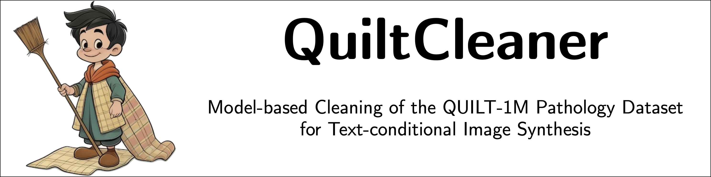

Welcome to the QuiltCleaner repository. We labeled 1% of the QUILT_1M dataset for common image impurities that would be deteriorating image generation in a text-conditional image synthesis setting. We provide predictions for the remaining 99% of the QUILT_1M dataset. Additionally, we provide scores for text-image alignment as provided by the CONCH vision-language model.

Paper (accepted for MIDL 2024): [Aubreville et al: Model-based Cleaning of the QUILT-1M Pathology Dataset for Text-Conditional Image Synthesis](https://openreview.net/forum?id=m7wYKrUjzV)


## Base dataset

These annotations and predictions are complimenting the QUILT_1M dataset (Ikezogwo et al., NeurIPS 2023). Please look at [their repository](https://quilt1m.github.io) as to how to retrieve it.

## Categories

We annotated a random 1% sample of the QUILT-1M dataset for the following categories:
- Narrator/person: Image with a visible person within the image
- Desktop/Window decorations/Slide viewer: Image where window decorators (e.g., close button, maximize button, title bar) or a complete slide viewer application, or even the windows task bar/desktop can be seen.
- Text/logo: Image contains visible text on top of the main pathology image, or one or multiple logos.
- Image of insufficient quality: Images in this category are mostly non-histology images (endoscopy, macro images, radiology images, only text images) but partially also just images with severe quality issues (blank image, severe blurryness).
- Additional slide overview: A slide overview (thumbnail) is shown on top of the actual slide image.
- Additional buttons/control elements: Additional control elements such as +/- buttons or rotation control are shown on top of the actual slide.
- Multi-panel image: Images consisting of multiple sub-images (panels). These are tricky for text-conditional image synthesis as the text might only describe a single (non-specified) panel.

## How to use

The annotations are provided in the following files:
- [train_annotations.csv](train_annotations.csv) Training set (70%)
- [val_annotations.csv](val_annotations.csv) Validation set (15%, used for model selection)
- [test_annotations.csv](test_annotations.csv) Hold out test set (15%)

You will need to download the QUILT-1M dataset separately, as this can not be provided in this repository due to licensing reasons. Place all files that were annotated into the *images* folder of this repository. Then, you will be able to train your own QuiltCleaner using the [provided notebook](Train-QuiltCleaner.ipynb). 


## Citation

```
@inproceedings{aubreville2024modelbased,
      title={Model-based Cleaning of the QUILT-1M Pathology Dataset for Text-Conditional Image Synthesis}, 
      author={Marc Aubreville and Jonathan Ganz and Jonas Ammeling and Christopher C. Kaltenecker and Christof A. Bertram},
      booktitle={Medical Imaging with Deep Learning},
      url={https://openreview.net/forum?id=m7wYKrUjzV},
      year={2024},
      eprint={2404.07676},
      archivePrefix={arXiv},
}
```
